# Microsoft Fabric and OTEL based Platform Observability Sample


## Problem (Use Case)

The company strategy focus is to leverage Microsoft Fabric as a main data platform. The Operations team is responsible for operating a larger number of applications across the enterprise, and as such, the team already uses Microsoft Fabric environment for a set of operational reports and dashboards. 

Traditionally, Infra and Operations teams has leveraged various third-party technologies for collection, storing and platform telemetry analysis. However, with the existing Microsoft Fabric investment and expertise, the company now would like to leverage Microsoft Fabric investments for comprehensive platform observability rather than maintaining separate monitoring infrastructure.

## Solution

We will use [OTEL Gateway Deployment pattern](https://opentelemetry.io/docs/collector/deployment/gateway/) with containerized version of OTEL Collector.

The solution implements a centralized telemetry processing architecture where Azure services send diagnostic data to Azure Event Hub, while applications emit telemetry directly via OTLP protocols. An OTEL Collector running in Azure Container Instance acts as a gateway, processing and routing all telemetry data to Microsoft Fabric Real-Time Intelligence. The data is then structured into dedicated OTEL tables (Logs, Metrics, Traces) within a KQL database for analysis and monitoring.

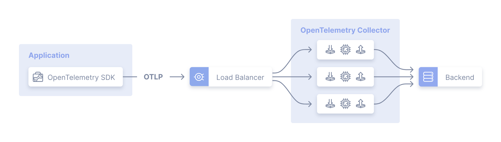

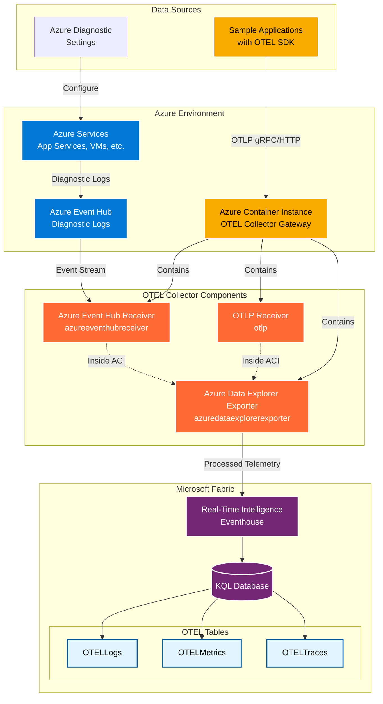


## Summary of Steps

- Deploy Microsoft Fabric for OTEL Observability use
- Deploy Azure Event Hub for Azure Diagnostic exports
- Deploy OTEL contrib distribution as Azure Diagnostic receiver
- Deploy telemetry sample Azure services

The following sections describe Azure Portal deployment and configuration based steps for manual setup and understanding of the solution components.

> **Note:** For Infrastructure as Code (Bicep) deployment, see the [Deployment Guide](./deploy/README.md#-infrastructure-as-code-bicep-deployment)


## Deploy Microsoft Fabric for OTEL Observability

Follow Microsoft Learn article for [configuring OTEL collection for Azure Data Explorer (or Microsoft Fabric Real-Time Intelligence)](https://learn.microsoft.com/azure/data-explorer/open-telemetry-connector). 

Create Fabric Eventhouse
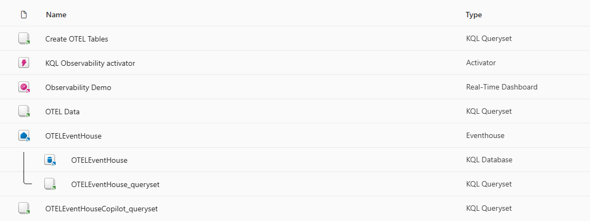

Create OTEL tables

```kusto
.create-merge table <Logs-Table-Name> (Timestamp:datetime, ObservedTimestamp:datetime, TraceID:string, SpanID:string, SeverityText:string, SeverityNumber:int, Body:string, ResourceAttributes:dynamic, LogsAttributes:dynamic) 

.create-merge table <Metrics-Table-Name> (Timestamp:datetime, MetricName:string, MetricType:string, MetricUnit:string, MetricDescription:string, MetricValue:real, Host:string, ResourceAttributes:dynamic,MetricAttributes:dynamic) 

.create-merge table <Traces-Table-Name> (TraceID:string, SpanID:string, ParentID:string, SpanName:string, SpanStatus:string, SpanKind:string, StartTime:datetime, EndTime:datetime, ResourceAttributes:dynamic, TraceAttributes:dynamic, Events:dynamic, Links:dynamic)
```

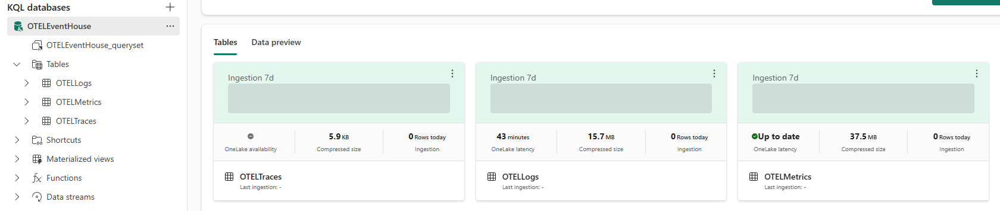


## Deploy Azure Event Hub

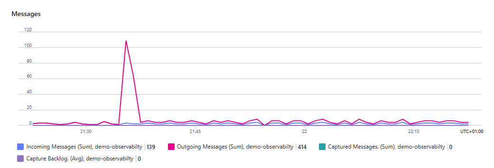

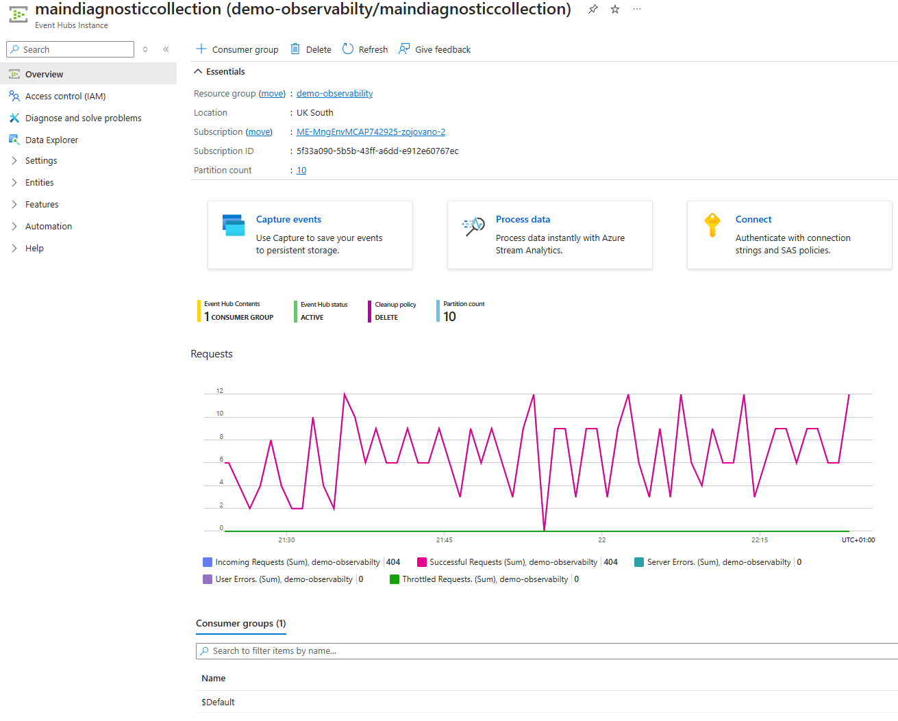

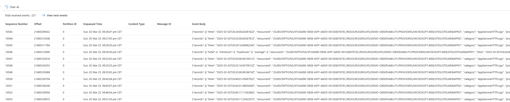

Sample Event Hub diagnostic record from Azure App Service

```json
{
    "records": [
        {
            "time": "2025-03-02T20:24:00.8208182Z",
            "resourceId": "/SUBSCRIPTIONS/5F33A090-5B5B-43FF-A6DD-E912E60767EC/RESOURCEGROUPS/DEMO-OBSERVABILITY/PROVIDERS/MICROSOFT.WEB/SITES/OTELWEBAPP02",
            "category": "AppServiceHTTPLogs",
            "properties": {
                "CsMethod": "GET",
                "CsUriStem": "/",
                "SPort": "443",
                "CIp": "52.158.28.64",
                "UserAgent": "Mozilla/5.0+(compatible;+MSIE+9.0;+Windows+NT+6.1;+Trident/5.0;+AppInsights)",
                "CsHost": "otelwebapp02-b4ejc3ckb9ecd9fd.uksouth-01.azurewebsites.net",
                "ScStatus": 200,
                "ScSubStatus": "0",
                "ScWin32Status": "0",
                "ScBytes": 2140,
                "CsBytes": 1386,
                "TimeTaken": 17,
                "Result": "Success",
                "Cookie": "-",
                "CsUriQuery": "X-ARR-LOG-ID=aa4d225f-5f9d-4ad3-9ce9-3a85565c0b49",
                "CsUsername": "-",
                "Referer": "-",
                "ComputerName": "WEBWK000003"
            }
        }
    ]
}
```


## Deploy OTEL contrib distribution as Azure Diagnostic receiver

[OpenTelemetry Collector Contrib](https://github.com/open-telemetry/opentelemetry-collector-contrib) distribution will be configured and deployed as a Azure Container Instance as a OTEL Collector Gateway. 
Docker image "otel/opentelemetry-collector-contrib" 

We will use [Azure Event Hub Receiver](https://github.com/open-telemetry/opentelemetry-collector-contrib/blob/main/receiver/azureeventhubreceiver/README.md) which is part of the "OpenTelemetry Collector Contrib" distribution. 
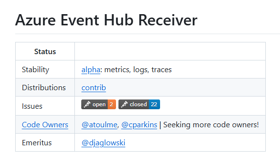

and [Azure Data Explorer Exporter](https://github.com/open-telemetry/opentelemetry-collector-contrib/blob/main/exporter/azuredataexplorerexporter/README.md)

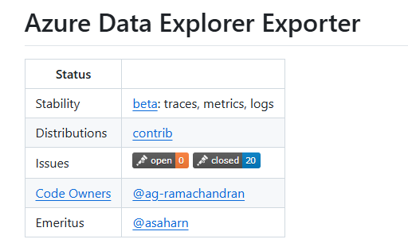

You can search for available extensions in the [OTEL registry](https://opentelemetry.io/ecosystem/registry/).

Following is the full OTEL config.yaml content:

```yml
extensions:

receivers:
  otlp:
    protocols:
      grpc:
        endpoint: 0.0.0.0:4317

  azureeventhub:
    connection: Endpoint=sb://namespace.servicebus.windows.net/;SharedAccessKeyName=RootManageSharedAccessKey;SharedAccessKey=<key>;EntityPath=maindiagnosticcollection
    partition: ""
    group: $Default
    offset: ""
    format: "azure"

processors:
  batch:

exporters:
  debug:
    verbosity: basic
  azuredataexplorer:
    cluster_uri: "https://trd-sxwndfr8sm0vy6844c.z5.kusto.fabric.microsoft.com"
    application_id: "c84761b4-8a31-4cd9-baf9-bd6752190365"
    application_key: "<key>"
    tenant_id: "539d8bb1-bbd5-4f9d-836d-223c3e6d1e43"
    db_name: "OTELEventHouse"
    metrics_table_name: "OTELMetrics"
    logs_table_name: "OTELLogs"
    traces_table_name: "OTELTraces"
    ingestion_type : "managed"

service:

  pipelines:

    traces:
      receivers: [otlp]
      processors: [batch]
      exporters: [debug,azuredataexplorer]

    metrics:
      receivers: [otlp,azureeventhub]
      processors: [batch]
      exporters: [debug,azuredataexplorer]

    logs:
      receivers: [otlp,azureeventhub]
      processors: [batch]
      exporters: [debug,azuredataexplorer]
```

Deployed Azure Container with OTEL Collector

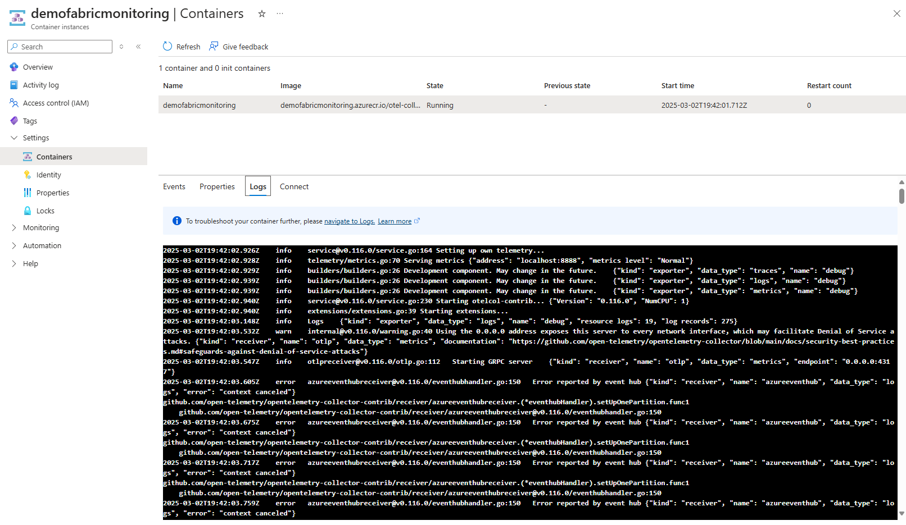


## Deploy telemetry sample Azure services

Deploy two Azure App Services and configure Diagnostic settings to send the telemetry to configured Azure Event Hub.

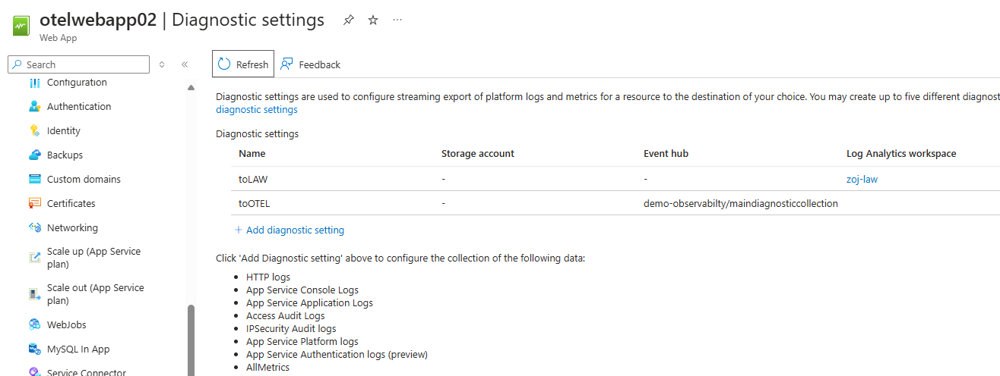

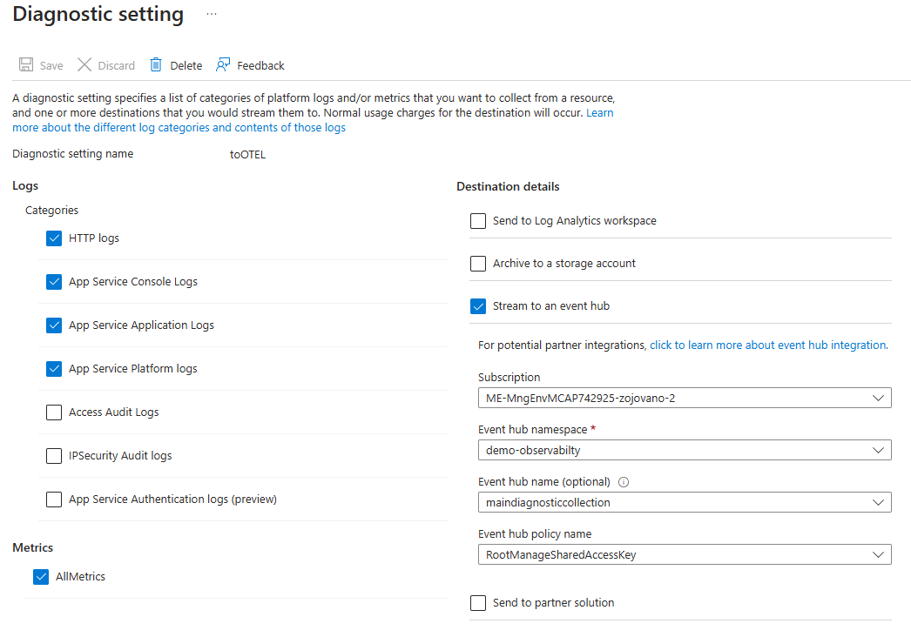


## References
- https://learn.microsoft.com/en-us/azure/data-explorer/open-telemetry-connector?context=%2Ffabric%2Fcontext%2Fcontext-rti&pivots=fabric&tabs=command-line
- https://github.com/open-telemetry/opentelemetry-dotnet/tree/main/docs
