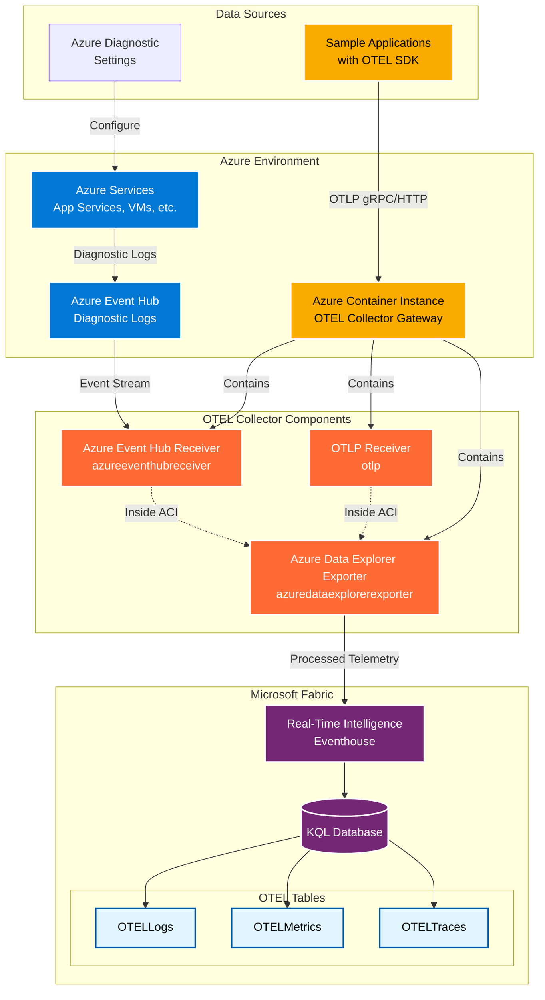

# Microsoft Fabric and OTEL based Platform Observability Sample


## Problem (Use Case)

The company strategy focus is to leverage Microsoft Fabric as a main data platform. The Operations team is responsible for operating a larger number of applications across the enterprise, and as such, the team already uses Microsoft Fabric environment for a set of operational reports and dashboards. 

Traditionally, Infra and Operations teams has leveraged various third-party technologies for collection, storing and platform telemetry analysis. However, with the existing Microsoft Fabric investment and expertise, the company now would like to leverage Microsoft Fabric investments for comprehensive platform observability rather than maintaining separate monitoring infrastructure.

## Solution

We will use [OTEL Gateway Deployment pattern](https://opentelemetry.io/docs/collector/deployment/gateway/) with containerized version of OTEL Collector.

The solution implements a centralized telemetry processing architecture where Azure services send diagnostic data to Azure Event Hub, while applications emit telemetry directly via OTLP protocols. An OTEL Collector running in Azure Container Instance acts as a gateway, processing and routing all telemetry data to Microsoft Fabric Real-Time Intelligence. The data is then structured into dedicated OTEL tables (Logs, Metrics, Traces) within a KQL database for analysis and monitoring.





## Summary of Steps

- Deploy Microsoft Fabric for OTEL Observability use
- Deploy Azure Event Hub for Azure Diagnostic exports
- Deploy OTEL contrib distribution as Azure Diagnostic receiver
- Deploy telemetry sample Azure services

The following sections describe Azure Portal deployment and configuration based steps for manual setup and understanding of the solution components.

> **Note:** For Infrastructure as Code (Bicep) deployment, see the [Deployment Guide](./deploy/README.md#-infrastructure-as-code-bicep-deployment)

## Deploy Azure Event Hub

Azure Event Hub serves as the central ingestion point for diagnostic logs from Azure services in this observability solution. The OTEL Collector will connect to Event Hub to receive and process diagnostic data before forwarding it to Microsoft Fabric.


> **Reference**: Follow the complete tutorial in Microsoft Learn: [Quickstart: Create an event hub using Azure portal](https://learn.microsoft.com/en-us/azure/event-hubs/event-hubs-create)

#### 1. Create Event Hub Namespace

1. In the Azure portal, select **All services** → **Analytics** → **Event Hubs**
2. On the **Event Hubs** page, select **Create**
3. On the **Create namespace** page, configure:
   - **Subscription**: Select your Azure subscription
   - **Resource group**: Select or create a resource group
   - **Namespace name**: Enter a unique name (e.g., `eh-otel-observability-{suffix}`)
   - **Location**: Select your preferred region
   - **Pricing tier**: Select **Standard** (required for diagnostic integration)
   - **Throughput units**: Set to **1** (can auto-scale up to 20)
   - **Enable Auto-Inflate**: ✅ Check this option
   - **Maximum throughput units**: Set to **20**
   - **Zone redundant**: ✅ Enable for high availability
4. Select **Review + Create** → **Create**
5. Wait for deployment completion and select **Go to resource**

#### 2. Create Event Hub

1. On the Event Hub namespace **Overview** page, select **+ Event Hub**
2. Configure the event hub:
   - **Name**: Enter `otel-diagnostics` (or your preferred name)
   - **Partition count**: Set to **4** (balances throughput and cost)
   - **Message retention**: Set to **7 days**
   - **Capture**: Leave disabled (not needed for this scenario)
3. Select **Review + create** → **Create**

#### 3. Configure Authorization Rule

1. In the Event Hub namespace, go to **Settings** → **Shared access policies**
2. Verify that **RootManageSharedAccessKey** exists with **Listen**, **Send**, and **Manage** permissions
3. Copy the **Primary Connection String** for later use in OTEL Collector configuration

#### 4. Verify Consumer Group

1. Navigate to your event hub → **Consumer groups**
2. Confirm that **$Default** consumer group exists (created automatically)
3. This will be used by the OTEL Collector to read events

### Configuration Summary

The Event Hub setup will include:
- **SKU**: Standard tier with auto-inflate enabled
- **Partitions**: 4 partitions for optimal throughput
- **Retention**: 7 days message retention
- **Throughput**: 1-20 throughput units with auto-scaling
- **Zone redundancy**: Enabled for high availability

### Sample Event Hub Record


Sample Event Hub diagnostic record from Azure App Service

```json
{
    "records": [
        {
            "time": "2025-03-02T20:24:00.8208182Z",
            "resourceId": "/SUBSCRIPTIONS/5F33A090-5B5B-43FF-A6DD-E912E60767EC/RESOURCEGROUPS/DEMO-OBSERVABILITY/PROVIDERS/MICROSOFT.WEB/SITES/OTELWEBAPP02",
            "category": "AppServiceHTTPLogs",
            "properties": {
                "CsMethod": "GET",
                "CsUriStem": "/",
                "SPort": "443",
                "CIp": "52.158.28.64",
                "UserAgent": "Mozilla/5.0+(compatible;+MSIE+9.0;+Windows+NT+6.1;+Trident/5.0;+AppInsights)",
                "CsHost": "otelwebapp02-b4ejc3ckb9ecd9fd.uksouth-01.azurewebsites.net",
                "ScStatus": 200,
                "ScSubStatus": "0",
                "ScWin32Status": "0",
                "ScBytes": 2140,
                "CsBytes": 1386,
                "TimeTaken": 17,
                "Result": "Success",
                "Cookie": "-",
                "CsUriQuery": "X-ARR-LOG-ID=aa4d225f-5f9d-4ad3-9ce9-3a85565c0b49",
                "CsUsername": "-",
                "Referer": "-",
                "ComputerName": "WEBWK000003"
            }
        }
    ]
}
```


## Deploy telemetry sample Azure services

Deploy Azure App Services that will generate diagnostic logs and send them to the configured Azure Event Hub. These services serve as sample data sources to demonstrate the observability solution in action.

> **Reference**: Follow the complete tutorial in Microsoft Learn: [Quickstart: Deploy a Python web app to Azure App Service](https://learn.microsoft.com/en-us/azure/app-service/quickstart-python)

#### 1. Create First App Service

1. In the Azure portal, search for **App Services** and select **App Services**
2. Select **Create** → **Web App**
3. On the **Basics** tab, configure:
   - **Subscription**: Select your Azure subscription
   - **Resource group**: Select the same resource group as your other resources
   - **Name**: Enter `otel-sample-app-01-{suffix}` (must be globally unique)
   - **Publish**: **Code**
   - **Runtime stack**: **Python 3.12** (or your preferred stack)
   - **Operating System**: **Linux**
   - **Region**: Select the same region as your other resources
   - **App Service Plan**: 
     - **Create new**: `otel-sample-plan`
     - **Pricing tier**: **Basic B1** (for diagnostic logging support)
4. Select **Review + create** → **Create**

#### 2. Create Second App Service

1. Repeat the same process for a second App Service
2. Use name: `otel-sample-app-02-{suffix}`
3. Use the **same App Service Plan** created above to save costs

#### 3. Configure Diagnostic Settings for App Service 1

1. Navigate to your first App Service
2. In the left menu, select **Monitoring** → **Diagnostic settings**
3. Select **Add diagnostic setting**
4. Configure the diagnostic setting:
   - **Diagnostic setting name**: `send-to-eventhub`
   - **Logs**: Select the following categories:
     - ✅ **AppServiceHTTPLogs**
     - ✅ **AppServiceConsoleLogs**
     - ✅ **AppServiceAppLogs**
     - ✅ **AppServicePlatformLogs**
   - **Destination details**: 
     - ✅ **Stream to an event hub**
     - **Event hub namespace**: Select your created Event Hub namespace
     - **Event hub name**: Select your created event hub
     - **Event hub policy name**: **RootManageSharedAccessKey**
5. Select **Save**


#### 4. Configure Diagnostic Settings for App Service 2

1. Navigate to your second App Service
2. Repeat the same diagnostic settings configuration as App Service 1
3. Use the same Event Hub namespace and event hub for consistency

#### 5. Generate Sample Traffic

1. Navigate to both App Services
2. Copy the **URL** from the Overview page of each app
3. Open the URLs in your browser to generate HTTP requests
4. Refresh the pages multiple times to create diagnostic log entries
5. The diagnostic logs will automatically flow to your Event Hub

#### 6. Verify Diagnostic Log Flow

1. Navigate to your Event Hub namespace
2. Go to **Monitoring** → **Metrics**
3. Check for **Incoming Messages** to confirm diagnostic data is flowing
4. In your OTEL Collector logs, you should see events being processed


### Configuration Summary

The sample App Services setup includes:
- **Two App Services**: Running on Basic B1 tier for diagnostic logging support
- **Diagnostic Settings**: Configured to send HTTP, Console, App, and Platform logs
- **Event Hub Integration**: All diagnostic logs stream to the central Event Hub
- **Sample Traffic**: Manual browsing generates realistic log data for testing


## Deploy OTEL contrib distribution as Azure Diagnostic receiver

The OpenTelemetry Collector serves as the central processing gateway in this solution, receiving diagnostic data from Azure Event Hub and application telemetry via OTLP protocols. It processes and routes all telemetry data to Microsoft Fabric Real-Time Intelligence for analysis and monitoring.

> **Reference**: Follow the complete tutorial in Microsoft Learn: [Quickstart: Deploy a container instance in Azure using the Azure portal](https://learn.microsoft.com/en-us/azure/container-instances/container-instances-quickstart-portal)

This solution uses a custom-built container image that includes the [OpenTelemetry Collector Contrib](https://github.com/open-telemetry/opentelemetry-collector-contrib) distribution with a pre-configured OTEL configuration file.

#### 1. Build Custom OTEL Collector Container

The custom container is built with the OTEL configuration embedded. The configuration includes:

- [Azure Event Hub Receiver](https://github.com/open-telemetry/opentelemetry-collector-contrib/blob/main/receiver/azureeventhubreceiver/README.md) for processing Azure diagnostic logs
- [Azure Data Explorer Exporter](https://github.com/open-telemetry/opentelemetry-collector-contrib/blob/main/exporter/azuredataexplorerexporter/README.md) for sending data to Microsoft Fabric
- OTLP Receiver for direct application telemetry


and [Azure Data Explorer Exporter](https://github.com/open-telemetry/opentelemetry-collector-contrib/blob/main/exporter/azuredataexplorerexporter/README.md)


You can search for other available extensions in the [OTEL registry](https://opentelemetry.io/ecosystem/registry/).

The custom container uses the following OTEL configuration (config.yaml):

```yml
extensions:

receivers:
  otlp:
    protocols:
      grpc:
        endpoint: 0.0.0.0:4317

  azureeventhub:
    connection: Endpoint=sb://namespace.servicebus.windows.net/;SharedAccessKeyName=RootManageSharedAccessKey;SharedAccessKey=<key>;EntityPath=maindiagnosticcollection
    partition: ""
    group: $Default
    offset: ""
    format: "azure"

processors:
  batch:

exporters:
  debug:
    verbosity: basic
  azuredataexplorer:
    cluster_uri: "https://trd-sxwndfr8sm0vy6844c.z5.kusto.fabric.microsoft.com"
    application_id: "c84761b4-8a31-4cd9-baf9-bd6752190365"
    application_key: "<key>"
    tenant_id: "539d8bb1-bbd5-4f9d-836d-223c3e6d1e43"
    db_name: "OTELEventHouse"
    metrics_table_name: "OTELMetrics"
    logs_table_name: "OTELLogs"
    traces_table_name: "OTELTraces"
    ingestion_type : "managed"

service:

  pipelines:

    traces:
      receivers: [otlp]
      processors: [batch]
      exporters: [debug,azuredataexplorer]

    metrics:
      receivers: [otlp,azureeventhub]
      processors: [batch]
      exporters: [debug,azuredataexplorer]

    logs:
      receivers: [otlp,azureeventhub]
      processors: [batch]
      exporters: [debug,azuredataexplorer]
```


#### 2. Create Azure Container Instance

1. In the Azure portal, select **Create a resource** → **Containers** → **Container Instances**
2. On the **Basics** page, configure:
   - **Subscription**: Select your Azure subscription
   - **Resource group**: Select the same resource group as your Event Hub
   - **Container name**: Enter `otel-collector-gateway`
   - **Region**: Select the same region as your Event Hub
   - **Image source**: Select **Azure Container Registry** (if using ACR) or **Other registry**
   - **Image type**: **Private** (if in ACR) or **Public** (if in public registry)
   - **Image**: Your custom OTEL collector image (e.g., `your-registry/otel-collector-custom:latest`)
   - **OS type**: **Linux**
   - **Size**: 
     - **CPU**: **2 cores**
     - **Memory**: **4 GB**

#### 3. Configure Networking

1. Select the **Networking** tab
2. Configure networking:
   - **Networking type**: **Public**
   - **DNS name label**: Enter a unique label (e.g., `otel-collector-{suffix}`)
   - **Ports**: Configure the following ports:
     - **Port 1**: `4317` (TCP) - OTLP gRPC receiver
     - **Port 2**: `8888` (TCP) - Metrics endpoint (optional)
     - **Port 3**: `13133` (TCP) - Health check endpoint (optional)

#### 4. Configure Environment Variables

1. Select the **Advanced** tab
2. Set **Restart policy**: **Always**
3. Configure **Environment variables** for dynamic configuration:
   - **EVENTHUB_CONNECTION_STRING**: Your Event Hub connection string
   - **FABRIC_CLUSTER_URI**: Your Microsoft Fabric cluster URI
   - **FABRIC_DATABASE_NAME**: Your KQL database name
   - **AZURE_CLIENT_ID**: Service principal client ID (if using)
   - **AZURE_CLIENT_SECRET**: Service principal secret (if using)
   - **AZURE_TENANT_ID**: Azure tenant ID

#### 5. Deploy and Verify

1. Select **Review + create** → **Create**
2. Wait for deployment completion
3. Navigate to the container instance resource
4. Verify the container status shows **Running**
5. Check the **Logs** tab to ensure OTEL Collector started successfully
6. Test connectivity to the OTLP endpoint: `http://<dns-name>.<region>.azurecontainer.io:4317`


### Configuration Summary

The custom OTEL Collector deployment includes:
- **Custom Image**: Pre-built with embedded OTEL configuration
- **Compute**: 2 CPU cores, 4 GB memory
- **Networking**: Public endpoint with OTLP gRPC on port 4317
- **Components**: Azure Event Hub receiver and Azure Data Explorer exporter
- **Configuration**: Embedded config file with environment variable overrides


## Deploy Microsoft Fabric for OTEL Observability

Follow Microsoft Learn article for [configuring OTEL collection for Azure Data Explorer (or Microsoft Fabric Real-Time Intelligence)](https://learn.microsoft.com/azure/data-explorer/open-telemetry-connector). 

Create Fabric Eventhouse


Create OTEL tables

```kusto
.create-merge table <Logs-Table-Name> (Timestamp:datetime, ObservedTimestamp:datetime, TraceID:string, SpanID:string, SeverityText:string, SeverityNumber:int, Body:string, ResourceAttributes:dynamic, LogsAttributes:dynamic) 

.create-merge table <Metrics-Table-Name> (Timestamp:datetime, MetricName:string, MetricType:string, MetricUnit:string, MetricDescription:string, MetricValue:real, Host:string, ResourceAttributes:dynamic,MetricAttributes:dynamic) 

.create-merge table <Traces-Table-Name> (TraceID:string, SpanID:string, ParentID:string, SpanName:string, SpanStatus:string, SpanKind:string, StartTime:datetime, EndTime:datetime, ResourceAttributes:dynamic, TraceAttributes:dynamic, Events:dynamic, Links:dynamic)
```


## References
- https://learn.microsoft.com/en-us/azure/data-explorer/open-telemetry-connector?context=%2Ffabric%2Fcontext%2Fcontext-rti&pivots=fabric&tabs=command-line
- https://github.com/open-telemetry/opentelemetry-dotnet/tree/main/docs
