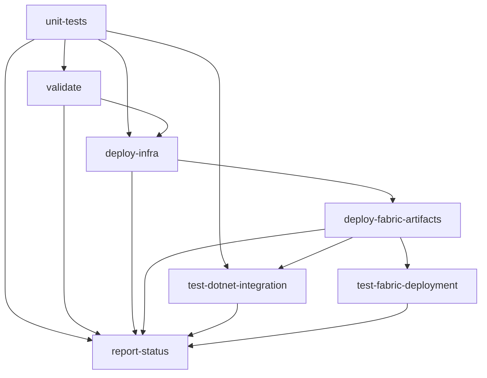

# GitHub Actions Troubleshooting Guide

## Common Workflow Failures & Solutions

### 🔐 1. Missing or Invalid GitHub Secrets

**Symptoms:**
- Authentication failures in Azure login steps
- "Client assertion is not within its valid time range" errors
- "AADSTS700016: Application with identifier was not found"

**Solutions:**
```bash
# Verify all required secrets are set in GitHub repository settings:
# Settings → Secrets and variables → Actions → Repository secrets

Required Secrets:
✅ AZURE_CLIENT_ID       # Service Principal Application ID
✅ AZURE_CLIENT_SECRET   # Service Principal Secret  
✅ AZURE_TENANT_ID       # Azure Tenant ID
✅ AZURE_SUBSCRIPTION_ID # Azure Subscription ID
✅ ADMIN_OBJECT_ID       # Object ID for Fabric capacity admin

# Create service principal:
az ad sp create-for-rbac --name "fabric-observability-github" \
  --role Contributor \
  --scopes /subscriptions/{SUBSCRIPTION_ID} \
  --output json

# Get admin object ID:
az ad user show --id "user@domain.com" --query id --output tsv
```

### 🐍 2. Fabric CLI Installation Issues

**Symptoms:**
- "fab: command not found"
- Python package installation failures
- Permission denied errors

**Solutions:**
```yaml
# Enhanced Fabric CLI installation step:
- name: Install Microsoft Fabric CLI (PowerShell)
  shell: pwsh
  run: |
    Write-Host "Installing Microsoft Fabric CLI..."
    python -m pip install --upgrade pip
    pip install ms-fabric-cli --no-cache-dir
    fab --version
    
    # Verify installation
    if (-not (Get-Command fab -ErrorAction SilentlyContinue)) {
      throw "Fabric CLI installation failed"
    }
```

### 💼 3. PowerShell Execution Issues

**Symptoms:**
- "execution of scripts is disabled on this system"
- PowerShell script syntax errors
- Path resolution issues

**Solutions:**
```yaml
# Fix PowerShell execution in workflow:
- name: Deploy Fabric Artifacts (PowerShell)
  shell: pwsh
  run: |
    # Set execution policy for GitHub Actions
    Set-ExecutionPolicy -ExecutionPolicy Bypass -Scope Process -Force
    
    # Use absolute paths
    $scriptPath = Join-Path $env:GITHUB_WORKSPACE "infra" "Deploy-FabricArtifacts.ps1"
    
    # Verify script exists
    if (-not (Test-Path $scriptPath)) {
      throw "Deploy script not found at: $scriptPath"
    }
    
    # Execute with error handling
    try {
      & $scriptPath
    } catch {
      Write-Error "Script execution failed: $_"
      throw
    }
```

### 🏗️ 4. Bicep Template Validation Failures

**Symptoms:**
- Template validation errors
- Resource deployment failures
- Parameter validation issues

**Solutions:**
```bash
# Test locally first:
cd infra/Bicep
az bicep build --file main.bicep

# Check parameter files:
az deployment sub validate \
  --location swedencentral \
  --template-file main.bicep \
  --parameters parameters.json
```

### 🔄 5. Dependency Chain Issues

**Symptoms:**
- Jobs running out of order
- Dependencies not met
- Partial deployment failures

**Current Workflow Dependencies:**


### 🚀 Quick Fix Actions

1. **Check Secrets Configuration:**
```bash
# In repository Settings → Secrets → Actions
# Verify all 5 required secrets are present and not expired
```

2. **Test Service Principal Locally:**
```bash
az login --service-principal \
  --username $AZURE_CLIENT_ID \
  --password $AZURE_CLIENT_SECRET \
  --tenant $AZURE_TENANT_ID
```

3. **Validate Bicep Templates:**
```bash
cd infra/Bicep && az bicep build --file main.bicep
```

4. **Test PowerShell Scripts:**
```powershell
# Run locally to check for syntax errors
.\infra\Deploy-FabricArtifacts.ps1 -SkipAuth -WhatIf
```

### 🔧 Emergency Workarounds

**Option 1: Skip Fabric Deployment Temporarily**
```yaml
# Add to workflow dispatch inputs:
skip_fabric:
  description: 'Skip Fabric CLI deployment'
  default: false
  type: boolean

# Modify deploy-fabric-artifacts job:
if: github.event.inputs.skip_fabric != 'true'
```

**Option 2: Manual Deployment Mode**
```yaml
# Add manual trigger only:
on:
  workflow_dispatch:
    inputs:
      deployment_mode:
        description: 'Deployment mode'
        default: 'infrastructure-only'
        type: choice
        options:
        - infrastructure-only
        - fabric-only
        - full-deployment
```

### 📊 Debugging Commands

**Check Workflow Status:**
```bash
# If GitHub CLI is available:
gh run list --limit 5
gh run view --log-failed

# Check repository configuration:
gh api repos/{owner}/{repo}/actions/secrets --paginate
```

**Local Validation:**
```powershell
# Test individual components:
.\infra\Deploy-FabricArtifacts.ps1 -SkipAuth -WhatIf
.\tests\Test-FabricIntegration.ps1 -WhatIf

# Validate Bicep:
az bicep build --file .\infra\Bicep\main.bicep
```

### 🎯 Most Common Root Cause

**Service Principal Permissions Issue** - Ensure the service principal has:
- Contributor role on the subscription/resource group
- Fabric Capacity Admin role (must be assigned in Fabric portal)
- Valid credentials that haven't expired

Check with:
```bash
az role assignment list --assignee $AZURE_CLIENT_ID --output table
```
