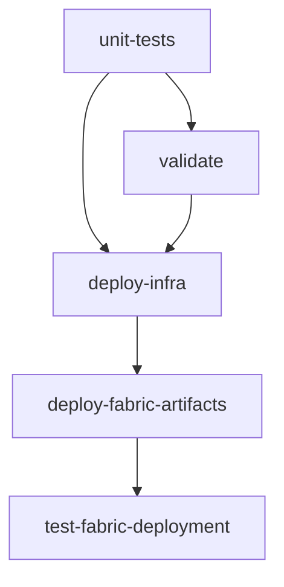

# Environment Setup and Troubleshooting Guide

This guide covers development environment setup, deployment procedures, and troubleshooting for the Azure Fabric OTEL Observability sample.

## 📖 Quick Navigation

| Section | Purpose | When to Use |
|---------|---------|-------------|
| [🚀 **Environment Setup**](#environment-setup) | DevContainer and local development | Setting up development environment |
| [🏗️ **Deployment Procedures**](#deployment-procedures) | Step-by-step deployment guide | Deploying the sample |
| [� **Infrastructure Removal**](#infrastructure-removal) | Complete resource cleanup | Removing all project resources |
| [�🔧 **Troubleshooting**](#troubleshooting) | Common issues and solutions | When encountering problems |
| [🧪 **Local Development**](LOCAL_DEVELOPMENT_SETUP.md) | Detailed development guide | In-depth development work |

---

## 🚀 Environment Setup

### DevContainer Setup (Recommended)

The sample includes a complete DevContainer for consistent development experience:

#### Prerequisites
- [VS Code](https://code.visualstudio.com/)
- [Dev Containers extension](https://marketplace.visualstudio.com/items?itemName=ms-vscode-remote.remote-containers)
- Docker or Podman container runtime

#### Quick Setup
```bash
# Clone and open in DevContainer
git clone https://github.com/zojovano/azuresamples-fabric-observability.git
cd azuresamples-fabric-observability
code .
# Click "Reopen in Container" when prompted
```

#### Git Configuration (Required)
**Option A: Environment Variables (Persists across rebuilds)**
```bash
# On your HOST system (Windows)
setx GIT_USER_NAME "Your Name"
setx GIT_USER_EMAIL "your@email.com"

# On your HOST system (Linux/Mac)
export GIT_USER_NAME="Your Name"
export GIT_USER_EMAIL="your@email.com"
# Add to ~/.bashrc for persistence
```

**Option B: Interactive Setup (Run after each rebuild)**
```bash
# Inside DevContainer
./.devcontainer/setup-git-config.sh
```

#### Verification
```bash
# Verify all required tools are installed
pwsh deploy/tools/Verify-DevEnvironment.ps1

# Include authentication check  
pwsh deploy/tools/Verify-DevEnvironment.ps1 -CheckAuth
```

### Manual Environment Setup

If not using DevContainer, install these tools:

#### Required Tools
- **Azure CLI**: `az` command
- **Microsoft Fabric CLI**: `fab` command  
- **.NET 8.0 SDK**: For sample applications
- **PowerShell 7.5.2+**: For deployment scripts
- **Python 3.11+**: For Fabric CLI
- **Git**: For version control

#### Installation Commands
```bash
# Azure CLI (Linux/Mac)
curl -sL https://aka.ms/InstallAzureCLIDeb | sudo bash

# Fabric CLI
pip install ms-fabric-cli

# PowerShell (Linux)
wget https://github.com/PowerShell/PowerShell/releases/download/v7.5.2/powershell_7.5.2-1.deb_amd64.deb
sudo dpkg -i powershell_7.5.2-1.deb_amd64.deb

# .NET SDK
wget https://dot.net/v1/dotnet-install.sh
bash dotnet-install.sh --version 8.0.100
```

---

## 🏗️ Deployment Procedures

### 🤖 Automated Deployment (Recommended)

**GitHub Actions with Shared Key Vault Integration**

#### Setup Requirements
1. **Platform Team Prerequisites** (managed externally):
   - Shared Azure Key Vault with access policies
   - Project secrets populated in Key Vault
   - Shared service principal with Key Vault permissions

2. **Repository Configuration** (developer responsibility):
   ```yaml
   # Required GitHub Secrets (minimal)
   SHARED_KEYVAULT_NAME: "platform-shared-keyvault"
   AZURE_CLIENT_ID: "shared-sp-client-id"
   AZURE_TENANT_ID: "azure-tenant-id"
   AZURE_SUBSCRIPTION_ID: "azure-subscription-id"
   ```

#### Workflow Process
1. **Fetch Secrets** - Retrieves project secrets from shared Key Vault
2. **Deploy Infrastructure** - Bicep templates for Azure resources
3. **Deploy Fabric Artifacts** - Fabric CLI for workspace, database, tables
4. **Run Tests** - Validation and integration testing

#### Triggering Deployment
- **Automatic**: Push to `main` branch
- **Manual**: Actions tab → "Run workflow" with optional parameters

### 🛠️ Manual Deployment

The project uses a unified deployment script that automatically loads configuration from `config/project-config.json`:

#### Complete Deployment
```powershell
# Simple deployment - uses centralized configuration
./deploy/infra/Deploy-Complete.ps1

# Preview what will be deployed
./deploy/infra/Deploy-Complete.ps1 -WhatIf

# Skip specific components
./deploy/infra/Deploy-Complete.ps1 -SkipFabricArtifacts    # Infrastructure only
./deploy/infra/Deploy-Complete.ps1 -SkipInfrastructure    # Fabric only
```

#### Legacy Individual Components
```powershell
# 1. Deploy Azure Infrastructure
cd deploy/infra/Bicep && ./deploy.ps1

# 2. Deploy Fabric Artifacts
./deploy/infra/Deploy-FabricArtifacts.ps1

# 3. Validate Deployment
./tests/Test-FabricIntegration.ps1
```

---

## 🔥 Infrastructure Removal

### ⚠️ DESTRUCTIVE OPERATION WARNING

The `Destroy-Complete.ps1` script **PERMANENTLY REMOVES** all project resources. Use with extreme caution!

#### Safe Preview (RECOMMENDED)
```powershell
# ALWAYS preview first to see what will be removed
./deploy/infra/Destroy-Complete.ps1 -WhatIf
```

#### Complete Destruction
```powershell
# Complete removal with confirmation prompt
./deploy/infra/Destroy-Complete.ps1

# Partial removal options
./deploy/infra/Destroy-Complete.ps1 -SkipFabricArtifacts  # Keep Fabric data
./deploy/infra/Destroy-Complete.ps1 -SkipInfrastructure   # Keep Azure resources

# Include service principals (VERY DESTRUCTIVE)
./deploy/infra/Destroy-Complete.ps1 -RemoveServicePrincipals

# Automated destruction (DANGEROUS - no prompts)
./deploy/infra/Destroy-Complete.ps1 -Force
```

#### What Gets Removed

**🏗️ Microsoft Fabric Resources**
- Workspace: `azuresamples-platformobservabilty-fabric`
- Database: `otelobservabilitydb` 
- KQL Tables: `OTELLogs`, `OTELMetrics`, `OTELTraces`
- All workspace data and configurations

**☁️ Azure Infrastructure**
- Resource Group: `azuresamples-platformobservabilty-fabric`
- Fabric Capacity: `fabriccapacityobservability`
- Event Hub Namespace: `evhns-otel`
- Container Instance: `ci-otel-collector`
- App Service and App Service Plan
- All associated storage, networking, and monitoring resources

**🔐 Service Principals (Optional)**
- GitHub Actions Service Principal
- Application Service Principal
- Only removed when `-RemoveServicePrincipals` specified

#### Safety Features
- **Confirmation Required**: Must type 'DESTROY' to confirm
- **What-If Mode**: Preview without making changes
- **Selective Removal**: Skip Fabric or Azure components
- **Configuration Loading**: Uses centralized config automatically

---

## 🔧 Troubleshooting

### 🔐 Authentication Issues

#### GitHub Actions Failures
**Symptoms**: Authentication errors, missing secrets, invalid credentials

**Solutions**:
1. **Verify GitHub Secrets**: Settings → Secrets → Actions
2. **Check Service Principal**: Ensure valid and not expired
3. **Validate Key Vault Access**: Confirm shared service principal permissions

```bash
# Test service principal locally
az login --service-principal \
  --username $AZURE_CLIENT_ID \
  --password $AZURE_CLIENT_SECRET \
  --tenant $AZURE_TENANT_ID
```

#### Fabric CLI Authentication
**Symptoms**: "fab: command not found", authentication failures

**Solutions**:
```powershell
# Check installation
fab --version

# Re-authenticate
fab auth logout
fab auth login
fab auth whoami
```

### 🏗️ Deployment Issues

#### Bicep Template Failures
**Common Issues**:
- Resource naming conflicts
- Permission errors
- Quota exceeded

**Solutions**:
```bash
# Validate templates
az bicep build --file main.bicep

# Check deployment
az deployment sub show --name "your-deployment"
```

#### Fabric Workspace Permissions
**Symptoms**: Cannot create workspace, capacity not found

**Required Actions** (Fabric Administrator):
1. **Enable Tenant Settings**: Allow workspace creation
2. **Configure Security Groups**: Add service principal to appropriate groups
3. **Assign Capacity Admin**: Grant admin permissions on Fabric capacity

**Verification**:
```powershell
# Test workspace operations
fab workspace list
fab workspace create --display-name "test-workspace"
```

### 🐍 PowerShell and CLI Issues

#### PowerShell Execution Problems
**Symptoms**: Execution policy errors, script syntax issues

**Solutions**:
```yaml
# Use PowerShell Core in workflows
shell: pwsh
run: |
  # Use absolute paths
  $scriptPath = Join-Path $env:GITHUB_WORKSPACE "infra" "Deploy-FabricArtifacts.ps1"
  & $scriptPath
```

#### Tool Installation Failures
**Solutions**:
```powershell
# Install Fabric CLI
python -m pip install --upgrade pip
pip install ms-fabric-cli --no-cache-dir

# Verify installation
fab --version
```

### 🔄 Workflow Dependencies

**Common Issue**: Jobs running out of order or failing dependencies

**Solution**: Review workflow dependencies:


### 🚀 Quick Fix Actions

1. **Check All Secrets**: Verify GitHub repository secrets are present
2. **Test Locally**: Run scripts locally with `-WhatIf` parameter
3. **Validate Templates**: Build Bicep templates before deployment
4. **Check Permissions**: Ensure service principal has all required roles
5. **Restart Workflow**: Sometimes temporary Azure service issues resolve themselves

### 🔧 Emergency Workarounds

**Skip Fabric Deployment Temporarily**:
```yaml
# Add to workflow inputs
skip_fabric:
  description: 'Skip Fabric CLI deployment'
  default: false
  type: boolean
```

**Infrastructure Only Mode**:
```yaml
deployment_mode:
  description: 'Deployment mode'
  default: 'full-deployment'
  type: choice
  options:
  - infrastructure-only
  - fabric-only
  - full-deployment
```

---

## 📋 Additional Resources

### Key Files
- **Main Deployment Script**: `deploy/infra/Deploy-FabricArtifacts.ps1`
- **Bicep Templates**: `deploy/infra/Bicep/main.bicep`
- **KQL Table Definitions**: `deploy/infra/kql-definitions/tables/`
- **Test Suite**: `tests/Test-FabricIntegration.ps1`
- **DevContainer Config**: `.devcontainer/devcontainer.json`

### External Documentation
- [Microsoft Fabric CLI Documentation](https://learn.microsoft.com/en-us/rest/api/fabric/articles/fabric-command-line-interface)
- [Azure Bicep Documentation](https://docs.microsoft.com/azure/azure-resource-manager/bicep/)
- [OpenTelemetry with Azure Data Explorer](https://learn.microsoft.com/azure/data-explorer/open-telemetry-connector)
- [GitHub Actions Documentation](https://docs.github.com/actions)

### Support
- **Issues**: Use GitHub Issues for bug reports
- **Discussions**: Use GitHub Discussions for questions
- **Local Development**: See [LOCAL_DEVELOPMENT_SETUP.md](LOCAL_DEVELOPMENT_SETUP.md)

---

*This consolidated documentation replaces multiple scattered files with a single comprehensive guide.*
