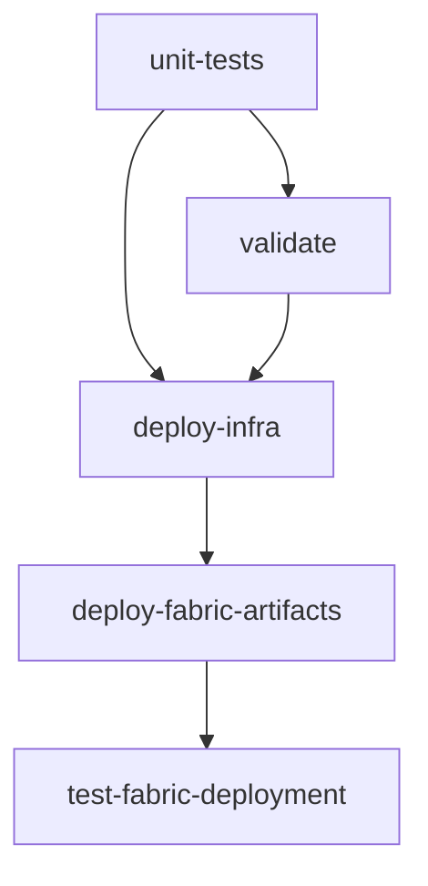

# Environment Setup and Troubleshooting Guide

This guide covers development environment setup, deployment procedures, and troubleshooting for the Azure Fabric OTEL Observability sample.

## 📖 Quick Navigation

| Section | Purpose | When to Use |
|---------|---------|-------------|
| [🚀 **Environment Setup**](#environment-setup) | DevContainer and local development | Setting up development environment |
| [🧪 **Local Development**](#local-development) | Secret management and testing | Development and testing work |
| [🏗️ **Deployment Procedures**](#deployment-procedures) | Step-by-step deployment guide | Deploying the sample |
| [🔥 **Infrastructure Removal**](#infrastructure-removal) | Complete resource cleanup | Removing all project resources |
| [🔧 **Troubleshooting**](#troubleshooting) | Common issues and solutions | When encountering problems |

---

## 🚀 Environment Setup

### DevContainer Setup (Recommended)

The sample includes a complete DevContainer for consistent development experience:

#### Prerequisites
- [VS Code](https://code.visualstudio.com/)
- [Dev Containers extension](https://marketplace.visualstudio.com/items?itemName=ms-vscode-remote.remote-containers)
- Docker or Podman container runtime

#### Getting Started

1. **Open in DevContainer:**
   ```bash
   # Clone and open in VS Code
   git clone https://github.com/zojovano/azuresamples-fabric-observability.git
   cd azuresamples-fabric-observability
   code .
   
   # When prompted, click "Reopen in Container"
   # Or use Command Palette: "Dev Containers: Reopen in Container"
   ```

2. **Configure Git (Required for commits):**
   
   **Option A: Environment Variables (Recommended - persists across rebuilds)**
   ```bash
   # On your HOST system (not in container):
   # Windows:
   setx GIT_USER_NAME "Your Name"
   setx GIT_USER_EMAIL "your.email@example.com"
   
   # Linux/Mac:
   export GIT_USER_NAME="Your Name"
   export GIT_USER_EMAIL="your.email@example.com"
   # Add to ~/.bashrc for persistence
   ```
   
   **Option B: Interactive Setup (run inside container after rebuild)**
   ```bash
   ./.devcontainer/setup-git-config.sh
   # Or with parameters:
   ./.devcontainer/setup-git-config.sh "Your Name" "your.email@example.com"
   ```

3. **Verify DevContainer Environment** (recommended first step):
   ```bash
   # Verify all required tools are installed
   pwsh deploy/tools/Verify-DevEnvironment.ps1
   
   # Include authentication check  
   pwsh deploy/tools/Verify-DevEnvironment.ps1 -CheckAuth
   ```

#### What's Included
- **Azure CLI** with Bicep extension
- **Microsoft Fabric CLI** for Fabric management  
- **.NET 8.0** SDK for C# development
- **PowerShell 7.5.2** for scripting
- **Python 3.11** with pip
- **Git** with VS Code credential integration
- **All VS Code extensions** for Azure, .NET, PowerShell development

### Manual Environment Setup

If not using DevContainer, install these tools:

#### Required Tools
- **Azure CLI**: `az` command
- **Microsoft Fabric CLI**: `fab` command  
- **.NET 8.0 SDK**: For sample applications
- **PowerShell 7.5.2+**: For deployment scripts
- **Python 3.11+**: For Fabric CLI
- **Git**: For version control

#### Installation Commands
```bash
# Azure CLI (Linux/Mac)
curl -sL https://aka.ms/InstallAzureCLIDeb | sudo bash

# Fabric CLI
pip install ms-fabric-cli

# PowerShell (Linux)
wget https://github.com/PowerShell/PowerShell/releases/download/v7.5.2/powershell_7.5.2-1.deb_amd64.deb
sudo dpkg -i powershell_7.5.2-1.deb_amd64.deb

# .NET SDK
wget https://dot.net/v1/dotnet-install.sh
bash dotnet-install.sh --version 8.0.100
```

---

## 🧪 Local Development

### Secret Management Options

#### Option 1: User Secrets (Recommended for Development)

1. **Setup secrets interactively:**
   ```powershell
   pwsh deploy/tools/Test-FabricLocal.ps1 -SetupSecrets
   ```

2. **Test authentication:**
   ```powershell
   pwsh deploy/tools/Test-FabricLocal.ps1 -TestAuth
   ```

3. **Run deployment:**
   ```powershell
   pwsh deploy/tools/Test-FabricLocal.ps1 -RunDeploy
   ```

#### Option 2: Azure Key Vault

1. **Test with Key Vault:**
   ```powershell
   pwsh deploy/tools/Test-FabricLocal.ps1 -Mode KeyVault -KeyVaultName "your-keyvault" -TestAuth
   ```

2. **Deploy with Key Vault:**
   ```powershell
   pwsh deploy/tools/Test-FabricLocal.ps1 -Mode KeyVault -KeyVaultName "your-keyvault" -RunDeploy
   ```

#### Option 3: Environment Variables

1. **Set environment variables:**
   ```powershell
   $env:AZURE_CLIENT_ID = "your-client-id"
   $env:AZURE_CLIENT_SECRET = "your-client-secret"
   $env:AZURE_TENANT_ID = "your-tenant-id"
   ```

2. **Test with environment:**
   ```powershell
   pwsh deploy/tools/Test-FabricLocal.ps1 -Mode Environment -TestAuth
   ```

### 🔧 Secret Handling (Updated)

The former `DevSecretManager` tool has been removed. Use one of these approaches instead:

1. **Key Vault (preferred for shared/team scenarios)**
   - Store: subscription ID, tenant ID, client ID, client secret
   - Deployment scripts or local scripts can retrieve them via Azure CLI / Az PowerShell

2. **Environment Variables (fast local iteration)**
   ```powershell
   $env:AZURE_SUBSCRIPTION_ID="<sub-id>"
   $env:AZURE_TENANT_ID="<tenant-id>"
   $env:AZURE_CLIENT_ID="<client-id>"
   $env:AZURE_CLIENT_SECRET="<client-secret>"
   ```

3. **User Secrets (optional .NET local only)**
   - Still supported by .NET if you run `dotnet user-secrets set`, but no custom wrapper tool is provided.

4. **Pester Diagnostics**
   ```powershell
   Invoke-Pester -Path tests/RunAllTests.ps1 -Tag Fabric,Diagnostics,Permissions
   ```

Security recommendations:
- Never commit secrets to Git.
- Prefer Key Vault for anything beyond personal experimentation.
- Rotate credentials periodically and update environment variables / Key Vault accordingly.

### 📋 Required Secrets

| Secret | Description | Example |
|--------|-------------|---------|
| `Azure:ClientId` | Service Principal Application ID | `12345678-1234-1234-1234-123456789012` |
| `Azure:ClientSecret` | Service Principal Secret | `your-secret-value` |
| `Azure:TenantId` | Azure Tenant ID | `87654321-4321-4321-4321-210987654321` |
| `Azure:SubscriptionId` | Azure Subscription ID | `11111111-2222-3333-4444-555555555555` |
| `Azure:ResourceGroupName` | Resource Group Name | `azuresamples-platformobservabilty-fabric` |
| `Fabric:WorkspaceName` | Fabric Workspace Name | `fabric-otel-workspace` |
| `Fabric:DatabaseName` | Fabric Database Name | `otelobservabilitydb` |

### 🧪 Testing Workflow

1. **Setup**: Configure secrets once using your preferred method
2. **Test**: Verify authentication works locally
3. **Deploy**: Run full deployment locally to test changes
4. **Commit**: Push working changes to GitHub Actions

### 🛠️ Development Benefits

- **Fast Iteration**: Test authentication changes locally
- **Secure Storage**: No secrets in source control
- **Multiple Options**: Choose the method that fits your workflow
- **Detailed Logging**: See exactly what's happening during authentication
- **Safe Testing**: Test without triggering GitHub Actions

### 📝 Local Development Best Practices

After your local testing works:
1. Verify the same service principal works in GitHub Actions
2. Ensure GitHub Secrets match your local configuration
3. Push your tested changes with confidence!

---

## 🏗️ Deployment Procedures

### 🤖 Automated Deployment (Recommended)

**GitHub Actions with Shared Key Vault Integration**

#### Setup Requirements
1. **Platform Team Prerequisites** (managed externally):
   - Shared Azure Key Vault with access policies
   - Project secrets populated in Key Vault
   - Shared service principal with Key Vault permissions

2. **Repository Configuration** (developer responsibility):
   ```yaml
   # Required GitHub Secrets (minimal)
   SHARED_KEYVAULT_NAME: "platform-shared-keyvault"
   AZURE_CLIENT_ID: "shared-sp-client-id"
   AZURE_TENANT_ID: "azure-tenant-id"
   AZURE_SUBSCRIPTION_ID: "azure-subscription-id"
   ```

#### Workflow Process
1. **Fetch Secrets** - Retrieves project secrets from shared Key Vault
2. **Deploy Infrastructure** - Bicep templates for Azure resources
3. **Deploy Fabric Artifacts** - Fabric CLI for workspace, database, tables
4. **Run Tests** - Validation and integration testing

#### Triggering Deployment
- **Automatic**: Push to `main` branch
- **Manual**: Actions tab → "Run workflow" with optional parameters

### 🛠️ Manual Deployment

The project uses a unified deployment script that automatically loads configuration from `deploy/config/project-config.json`:

#### Complete Deployment
```powershell
# Simple deployment - uses centralized configuration
#### Complete Deployment
```bash
# Navigate to infrastructure directory and run deployment
cd /workspaces/azuresamples-fabric-observability/deploy/infra
./Deploy-All.ps1

# Or run with preview mode first
./Deploy-All.ps1 -WhatIf

# Infrastructure only (skip Fabric artifacts)  
./Deploy-All.ps1 -SkipFabricArtifacts    # Infrastructure only
./Deploy-All.ps1 -SkipInfrastructure    # Fabric only
```

#### Legacy Individual Components
```powershell
# 1. Deploy Azure Infrastructure
cd deploy/infra/Bicep && ./deploy.ps1

# 2. Deploy Fabric Artifacts

# 3. Validate Deployment
./tests/Test-FabricIntegration-Git.ps1
```

---

## 🔥 Infrastructure Removal

### ⚠️ DESTRUCTIVE OPERATION WARNING

The `Destroy-All.ps1` script **PERMANENTLY REMOVES** all project resources. Use with extreme caution!

#### Safe Preview (RECOMMENDED)
```powershell
# ALWAYS preview first to see what will be removed
./deploy/infra/Destroy-All.ps1 -WhatIf
```

#### Complete Destruction
```powershell
# Complete removal with confirmation prompt
./deploy/infra/Destroy-All.ps1

# Partial removal options
./deploy/infra/Destroy-All.ps1 -SkipFabricArtifacts  # Keep Fabric data
./deploy/infra/Destroy-All.ps1 -SkipInfrastructure   # Keep Azure resources

# Include service principals (VERY DESTRUCTIVE)
./deploy/infra/Destroy-All.ps1 -RemoveServicePrincipals

# Automated destruction (DANGEROUS - no prompts)
./deploy/infra/Destroy-All.ps1 -Force
```

#### What Gets Removed

**🏗️ Microsoft Fabric Resources**
- Workspace: `azuresamples-platformobservabilty-fabric`
- Database: `otelobservabilitydb` 
- KQL Tables: `OTELLogs`, `OTELMetrics`, `OTELTraces`
- All workspace data and configurations

**☁️ Azure Infrastructure**
- Resource Group: `azuresamples-platformobservabilty-fabric`
- Fabric Capacity: `fabriccapacityobservability`
- Event Hub Namespace: `evhns-otel`
- Container Instance: `ci-otel-collector`
- App Service and App Service Plan
- All associated storage, networking, and monitoring resources

**🔐 Service Principals (Optional)**
- GitHub Actions Service Principal
- Application Service Principal
- Only removed when `-RemoveServicePrincipals` specified

#### Safety Features
- **Confirmation Required**: Must type 'DESTROY' to confirm
- **What-If Mode**: Preview without making changes
- **Selective Removal**: Skip Fabric or Azure components
- **Configuration Loading**: Uses centralized config automatically

---

## 🔧 Troubleshooting

### 🔐 Authentication Issues

#### GitHub Actions Failures
**Symptoms**: Authentication errors, missing secrets, invalid credentials

**Solutions**:
1. **Verify GitHub Secrets**: Settings → Secrets → Actions
2. **Check Service Principal**: Ensure valid and not expired
3. **Validate Key Vault Access**: Confirm shared service principal permissions

```bash
# Test service principal locally
az login --service-principal \
  --username $AZURE_CLIENT_ID \
  --password $AZURE_CLIENT_SECRET \
  --tenant $AZURE_TENANT_ID
```

#### Fabric CLI Authentication
**Symptoms**: "fab: command not found", authentication failures

**Solutions**:
```powershell
# Check installation
fab --version

# Re-authenticate
fab auth logout
fab auth login
fab auth whoami
```

### 🔍 Local Development Issues

#### Authentication Failures
- Verify service principal has correct permissions
- Check tenant and subscription IDs are correct
- Ensure Fabric CLI is properly installed

#### Missing Secrets
- Use Key Vault or environment variables instead of the removed DevSecretManager tool
- Use `-TestAuth` to verify all required secrets are present

#### Key Vault Access
- Ensure you're authenticated with Azure CLI: `az login`
- Verify Key Vault access permissions
- Check secret names match expected values

### 🏗️ Deployment Issues

#### Bicep Template Failures
**Common Issues**:
- Resource naming conflicts
- Permission errors
- Quota exceeded

**Solutions**:
```bash
# Validate templates
az bicep build --file main.bicep

# Check deployment
az deployment sub show --name "your-deployment"
```

#### Fabric Workspace Permissions
**Symptoms**: Cannot create workspace, capacity not found

**Required Actions** (Fabric Administrator):
1. **Enable Tenant Settings**: Allow workspace creation
2. **Configure Security Groups**: Add service principal to appropriate groups
3. **Assign Capacity Admin**: Grant admin permissions on Fabric capacity

**Verification**:
```powershell
# Test workspace operations
fab workspace list
fab workspace create --display-name "test-workspace"
```

### 🐍 PowerShell and CLI Issues

#### PowerShell Execution Problems
**Symptoms**: Execution policy errors, script syntax issues

**Solutions**:
```yaml
# Use PowerShell Core in workflows
shell: pwsh
run: |
  # Use absolute paths
  & $scriptPath
```

#### Tool Installation Failures
**Solutions**:
```powershell
# Install Fabric CLI
python -m pip install --upgrade pip
pip install ms-fabric-cli --no-cache-dir

# Verify installation
fab --version
```

### 🔄 Workflow Dependencies

**Common Issue**: Jobs running out of order or failing dependencies

**Solution**: Review workflow dependencies:


### 🚀 Quick Fix Actions

1. **Check All Secrets**: Verify GitHub repository secrets are present
2. **Test Locally**: Run scripts locally with `-WhatIf` parameter
3. **Validate Templates**: Build Bicep templates before deployment
4. **Check Permissions**: Ensure service principal has all required roles
5. **Restart Workflow**: Sometimes temporary Azure service issues resolve themselves

### 🔧 Emergency Workarounds

**Skip Fabric Deployment Temporarily**:
```yaml
# Add to workflow inputs
skip_fabric:
  description: 'Skip Fabric CLI deployment'
  default: false
  type: boolean
```

**Infrastructure Only Mode**:
```yaml
deployment_mode:
  description: 'Deployment mode'
  default: 'full-deployment'
  type: choice
  options:
  - infrastructure-only
  - fabric-only
  - full-deployment
```

---

## 📋 Additional Resources

### Key Files
- **Bicep Templates**: `deploy/infra/Bicep/main.bicep`
- **KQL Table Definitions**: `deploy/fabric-artifacts/tables/`
- **Test Suite**: `tests/Test-FabricIntegration-Git.ps1`
- **DevContainer Config**: `.devcontainer/devcontainer.json`

### External Documentation
- [Microsoft Fabric CLI Documentation](https://learn.microsoft.com/en-us/rest/api/fabric/articles/fabric-command-line-interface)
- [Azure Bicep Documentation](https://docs.microsoft.com/azure/azure-resource-manager/bicep/)
- [OpenTelemetry with Azure Data Explorer](https://learn.microsoft.com/azure/data-explorer/open-telemetry-connector)
- [GitHub Actions Documentation](https://docs.github.com/actions)

### Support
- **Issues**: Use GitHub Issues for bug reports
- **Discussions**: Use GitHub Discussions for questions
- **Local Development**: All development guidance is included in this document

---

*This consolidated documentation replaces multiple scattered files with a single comprehensive guide.*
